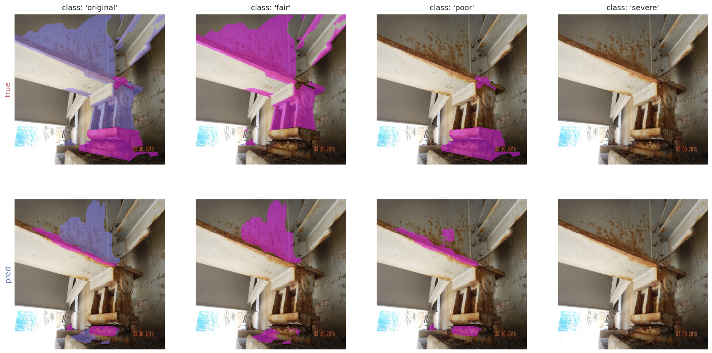

# Corrosion Detection on Steel Bridge Image Dataset

This repository includes the implementation for identifying corrosion that appeared on steel bridge images based on Mask R-CNN.

<p align="center">  </p>

## Getting Started

To train the model, run the following command
```
python -W ignore corrosion.py \
 train \
 --dataset=<dataset_path> \
 --weights=<checkpoint_path> \
 --logs=<path_to_save_log> \
```

* [corrosion.py](corrosion/corrosion.py): build a model and set configuration s.t. training parameters
* [data.ipynb](corrosion/data.ipynb): analyze data before training
* [model.ipynb](corrosion/model.ipynb): inspect the model before training
* [inspection-all.ipynb](corrosion/inspection-all.ipynb): visualize the training results
* [dataproc-4-mrcnn.ipynb](dataset/dataproc-4-mrcnn.ipynb): pre-process data to convert the label format


## Dataset

The original dataset was referenced from 
```
Bianchi, Eric; Hebdon, Matthew (2021). Corrosion Condition State Semantic Segmentation Dataset. University Libraries, Virginia Tech. Dataset. https://doi.org/10.7294/16624663.v2
```
and processed to train with instances for this repo.


## Pre-trained Network

You can download the pre-trained network for UAVCRACK dataset [here]([https://drive.google.com/file/d/19AYEglv8cAIz6vEos27OxCQScQhiTJiO/view?usp=sharing](https://uofnelincoln-my.sharepoint.com/:u:/g/personal/jlee90_unl_edu/ETSiqIwvJNtMiYsLxhgeLeUBHMKmPYLYjhPLx2M-Tml_0w?e=eThvGr)https://uofnelincoln-my.sharepoint.com/:u:/g/personal/jlee90_unl_edu/ETSiqIwvJNtMiYsLxhgeLeUBHMKmPYLYjhPLx2M-Tml_0w?e=eThvGr) and locate under `/checkpoint` directory.


## Mask R-CNN

The model used in this repo was originally implemented from [Mask R-CNN for Object Detection and Segmentation](https://github.com/matterport/Mask_RCNN). You can find step by step installation and instructions for training and inference with various demos from the original repo.
